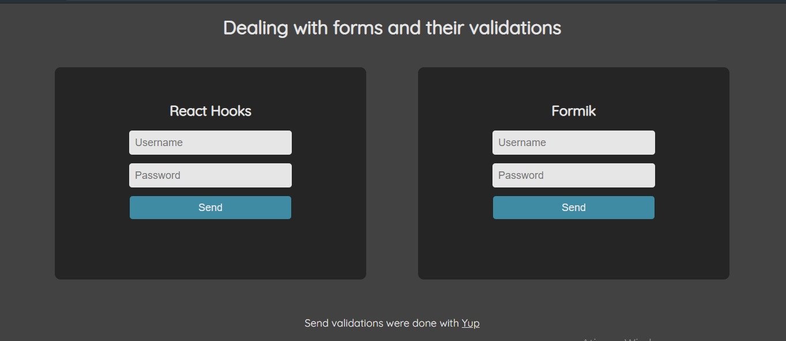

# Lidando com formulários e suas validações

    
    

## Sobre

Este projeto nasceu com a ideia de testar a lib Formik e Yup, mas também para comparar a efetividade do Formik em relação aos hooks do React.

Depois do experimento, me certifiquei que realmente o Formik é uma boa biblioteca, tendo em vista o ganho de produtividade e a facilidade em realizar as validações nos formulários.

## Imagem da aplicação
